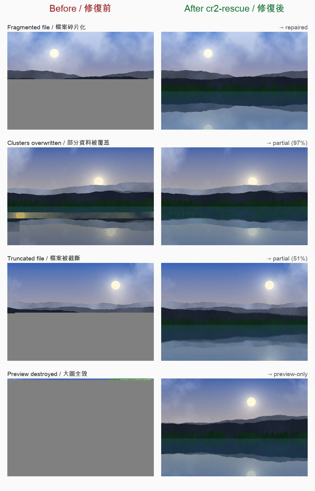
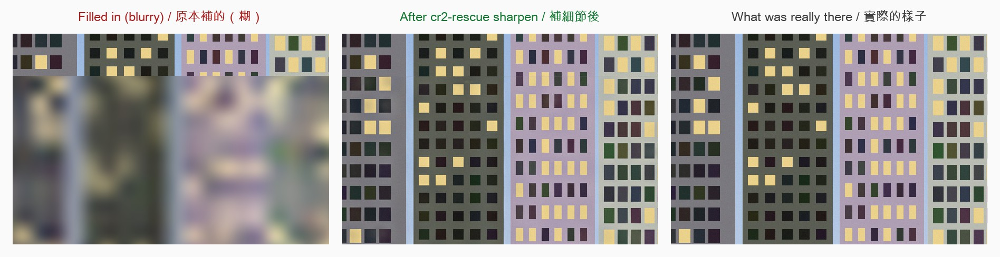
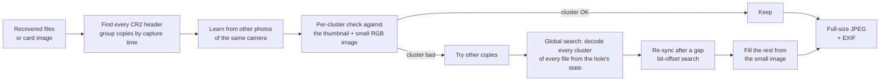

<h1 align="center">cr2-rescue</h1>

<p align="center">
  <b>Recover corrupted Canon CR2 RAW photos after SD card data recovery.</b><br>
  Rebuilds the full-size picture from CR2 files that won't open, show a grey bottom half, have shifted colours,
  or were cut short — by putting the right pieces back together.
</p>

<p align="center">
  <a href="https://github.com/yin1218/cr2-rescue/actions/workflows/ci.yml"></a>
  <a href="LICENSE"></a>
  
  
  <a href="https://github.com/yin1218/cr2-rescue/stargazers"></a>
</p>

<p align="center">
  <a href="#quick-start">Quick start</a> •
  <a href="#sharpen-the-filled-in-part-optional">Sharpen</a> •
  <a href="#how-it-works">How it works</a> •
  <a href="#faq">FAQ</a> •
  <a href="#compared-with-other-tools">Compared with other tools</a> •
  <a href="#limitations">Limitations</a><br>
  [English] [<a href="README.zh-TW.md">繁體中文</a>]
</p>

<p align="center"></p>
<p align="center"><sub>Synthetic demo (generated by <a href="examples/make_demo.py">examples/make_demo.py</a>). “Before” is what an ordinary viewer shows.</sub></p>

## Why

You deleted, formatted or lost a memory card, ran a recovery tool such as **PhotoRec, Disk Drill, Recuva, EaseUS or
R-Studio**, and got your `.CR2` files back — but many of them **won't open**, are **half grey**, show **wrong colours
or shifted blocks**, or are **much smaller than they should be**.

That happens because recovery tools assume each file is stored in one piece. On a well-used card, photos are often
**fragmented**: the middle of one photo sits after another photo, or parts were **overwritten** later. Viewers and
RAW converters then decode the wrong data.

Every Canon CR2 file carries, besides the RAW data, a **full-resolution JPEG** of the photo (the same picture the
camera shows; 5184×3456 on an 18 MP body) plus two small copies of it. `cr2-rescue` uses the small copies as a
map to check, cluster by cluster, which data really belongs to the photo, and rebuilds that full-size JPEG:

- ✅ **Lossless** when all pieces are found — bit-identical to what the camera wrote.
- 🧩 Combines **every copy** of a photo (recovery tools often save the same photo several times, damaged in
  different places).
- 🔎 Searches **all recovered files** (or a raw card image) for the missing pieces.
- 🎨 Fills what is truly gone from the photo's own small image, so you get the whole frame instead of a grey band.
- ✨ Optional: gives that filled-in part **detail again** — real detail from the photo you shot seconds before or after,
  and an AI upscaler ([Real-ESRGAN](https://github.com/xinntao/Real-ESRGAN)) for the rest.
- 🧠 **Learns from your other photos:** a photo whose JPEG header was overwritten borrows it from photos of the same
  camera (it is the same bytes in all of them), one whose small image lost its directory entry gets its place from
  the camera model, and one without a thumbnail borrows the colours of a photo taken minutes before or after.
- 📷 Keeps **EXIF** (capture time, camera, lens, exposure; with [ExifTool](https://exiftool.org) installed, all maker
  notes too) and sets the file date to the capture time, so photo apps sort them correctly.
- 🔒 Runs **offline** on your computer; originals are opened read-only and never changed.

## Quick start

Requires Python 3.10+.

```bash
pip install git+https://github.com/yin1218/cr2-rescue.git
# optional, copies all metadata incl. maker notes:  brew install exiftool  /  apt install libimage-exiftool-perl

cr2-rescue scan    ./recovered                  # what was found, how damaged (read-only, fast)
cr2-rescue recover ./recovered -o ./rescued     # rebuild everything
```

`./recovered` is the folder your recovery tool wrote (subfolders are searched too). You can pass several folders,
e.g. the output of two different tools — more copies means more chances to find every piece.

**Best results:** give it a raw image of the card instead of (or in addition to) the recovered files. It contains every
cluster, including the ones carving tools did not save:

```bash
sudo ddrescue /dev/sdX card.img card.map        # Linux; on macOS: sudo dd if=/dev/rdiskN of=card.img bs=1m
cr2-rescue recover card.img ./recovered --all-files -o ./rescued
```

`--all-files` makes it search every file, not only `*.cr2` (recovery tools sometimes give CR2 data other names).

### What you get

```
rescued/
├── intact/          the photo was fine (preview extracted losslessly)
├── repaired/        all pieces found and put back together — lossless
├── partial/         most of the photo recovered; the rest filled from its small image   "IMG_1234 (87%).jpg"
├── preview-only/    the full-size data is gone; the photo's small image, upscaled          "IMG_1234 (preview only).jpg"
├── unverified/      decodes, but nothing could verify it (no reference, or the small image shows another picture)
├── masks/           which pixels of each partial photo are decoded data (white); used by `sharpen`
├── report.csv       one row per photo: result, coverage, which files/copies were used
└── report.json
```

Example run (the synthetic card from the demo):

```text
$ cr2-rescue recover card/ -o rescued
Searching 8 file(s) for CR2 photos ...
Found 8 copies of 7 photo(s); cluster size 8192 bytes
Learning what photos of the same camera share ...
  Canon EOS Synthetic: same preview header in 7 of 7 photos, small image right after the preview in all 7
Locating the picture area of the small images ...
  Canon EOS Synthetic: picture area of the 200x133 image = (5, 3, 192, 128) (match 0.993, 5 photo(s), 2 preview-checked; 5 of 5 small images intact)
Pass 1: rebuilding 7 photo(s) ...
  intact: 2, repaired: 1, partial: 3, preview-only: 1
Global search: 4 hole(s) x every 8 KB cluster of 8 file(s) ...
  continuation found for 2 photo(s)
Pass 2: rebuilding 2 photo(s) ...
  intact: 2, repaired: 2, partial: 2, preview-only: 1
Copying full metadata with exiftool ...
Result: 2 intact, 2 repaired, 2 partial, 1 preview-only
```

### On a real card

498 photos from an EOS M2, recovered with data-recovery software from a damaged SD card; many files fragmented
or partly overwritten. One run, about 47 minutes on a laptop:

| Result | Photos |
|---|---:|
| intact (lossless) | 373 |
| repaired (lossless) | 15 |
| partial | 98 (median 72% recovered, 24 of them ≥ 90%) |
| preview-only | 8 |
| unverified | 1 |
| failed | 3 (preview and small image both overwritten) |

## Sharpen the filled-in part (optional)

Where the data is truly gone, the photo is filled in from the camera's thumbnail: right colours and shapes, but
blurry (the thumbnail has about 1/32 of the detail). `cr2-rescue sharpen` gives that part detail again, in two ways:



<sub>Synthetic scene made by <code>python examples/make_demo.py sharpen</code>: the data ran out just below the top row of windows.</sub>

| | how | the detail is | works on |
|---|---|---|---|
| **neighbour** | takes the detail from a photo shot seconds before or after: aligned with SIFT, optical flow for what moved, used only where it agrees with the fill | **real** | what did not change between the two shots: buildings, landscape, things on a table, text |
| **upscale** | an AI super-resolution model ([Real-ESRGAN](https://github.com/xinntao/Real-ESRGAN)) redraws the fill from what it shows | invented, but plausible | everything, including people and trees that moved |

By default both are used: the neighbour where it fits, the upscaler for the rest. Decoded data is never changed.

On the [real card above](#on-a-real-card), the 98 partial photos took about 100 minutes on a laptop (Apple M2).
28 had a neighbouring shot of the same scene, which gave real detail to a median 62% of their filled area; the
rest of the fill was redrawn by the upscaler. Edge strength in the filled area went up a median 3.4×, to about
three quarters of the decoded part of the same photo.

```bash
pip install 'cr2-rescue[sharpen] @ git+https://github.com/yin1218/cr2-rescue.git'
# the AI upscaler (optional): download realesrgan-ncnn-vulkan for your OS from
# https://github.com/xinntao/Real-ESRGAN/releases, unzip it, put it on PATH (or pass --upscaler PATH)
cr2-rescue sharpen ./rescued          # -> ./rescued/sharpened/, same file names
```

- The upscaler runs on the GPU (Vulkan; Metal on Apple silicon). Without it only the neighbouring photos are used.
  On macOS, if the downloaded binary is blocked: `xattr -d com.apple.quarantine realesrgan-ncnn-vulkan`.
- `sharpened/sharpen.json` tells for each photo which neighbour was used and how much of the filled area got real
  detail from it.
- A stopped run goes on where it was when started again (use another `-o` to redo photos with other settings).
- `--method neighbour|upscale|both`, `--model NAME` (any x4 model in the upscaler's `models` folder; default
  `realesrgan-x4plus`), `-j` photos at a time (about 2 GB of memory each).
- Needs the masks written by `recover` 0.2+; for an older output folder, run `recover` again.

## How it works



1. **Scan.** Every CR2 header (TIFF `II*\0` + `CR`) in every file is a *copy*. Copies with the same camera model and
   capture time (to 1/100 s) are the same photo. The card's cluster size is inferred from where headers sit.
2. **References.** Each CR2 has a 160×120 JPEG thumbnail and an uncompressed 16-bit linear RGB image (e.g. 660×441,
   with a masked sensor border). The picture area inside the border is located once per camera model, from photos
   whose small image matches their own thumbnail (on a damaged card many are overwritten even when the preview is
   fine) and pinned to the pixel with intact previews; the colour/tone transform is fitted to the thumbnail
   (robustly, ignoring damaged rows), then the thumbnail's colours are transferred region by region. Rows of the
   small image that were overwritten (noise over the whole 16-bit range) are recognised on their own and replaced by
   the nearest intact row.
3. **Learn from the other photos.** What all photos of one camera share is learnt from those where it is readable:
   - the preview's **JPEG header** (quantisation and Huffman tables — the same bytes in every photo taken with the
     same settings): a photo whose header was overwritten gets it back and decodes again;
   - **where the small image sits** (right after the preview): a photo whose directory entry for it was lost still
     has a reference;
   - the **colour style**: a photo without a usable thumbnail draws its small image in the style of the nearest photo
     in time, then refits it to the part of its own preview that decoded (one global fit, so foreign data cannot make
     itself match).

   If the small image does not show the picture that decodes (another photo's data was written there), it is not
   used at all: only what decodes straight on from the header is kept, in `unverified/`. The small image is stored
   after the preview, so it can also be the damaged one: a preview that decodes in one piece right up to its end
   marker and matches the thumbnail everywhere stays intact even where its small image disagrees.
4. **Verify cluster by cluster.** The baseline JPEG is decoded MCU by MCU; the average colour of every block is compared
   with the reference. The first cluster where the picture stops matching is where the file goes wrong.
5. **Repair.** From that point, try the data at the same position in other copies, then search *every* cluster of
   every input file for one that continues the picture seamlessly (decoded from the exact bit/DC state at the hole,
   with uniqueness checks and ownership checks so data belonging to another finished photo is never borrowed).
6. **Re-sync.** When nothing continues the picture, find where decodable data starts again after the gap
   (bit-offset search + normalised cross-correlation with the reference + DC offset correction), so one lost
   cluster costs a stripe, not the rest of the photo. In smooth areas (sky, a wall) the rows just above and below
   match almost as well; there the number of missing bytes picks the row.
7. **Final check.** Every run of data that came from another copy, the global search or a re-sync is compared with
   the reference over its whole length. In smooth areas (a wall, a dark background) a burst shot of the same scene
   can pass the per-cluster test; over a long run it shows up as low correlation or a shifted level and is dropped.
8. **Fill & export.** Areas that could not be recovered are filled from the upscaled small image. Lossless results are
   written byte-for-byte; filled results are re-encoded at quality 95 with EXIF.

The algorithm is tested end-to-end on a synthetic card ([`synth.py`](src/cr2rescue/synth.py)) that reproduces the
failure modes: fragmentation, overwritten clusters, truncation, multiple damaged copies, destroyed previews,
overwritten JPEG headers, thumbnails and small images.

## FAQ

### My recovered CR2 files won't open / are corrupted — can they be fixed?
Often, yes. If the file still has its header, `cr2-rescue` can usually rebuild the full-size picture from the embedded
JPEG, and from other copies or other recovered files if parts are missing. Run `cr2-rescue scan` first: it tells you
how many photos it found and how much of each decodes correctly.

### Recovered photos are half grey, have a grey bottom, or show shifted/wrong colours
That is the classic sign of a **fragmented** file: from some point on, the file contains data from another photo (or
nothing). This is exactly what `cr2-rescue` repairs. Give it all recovered files (or a card image) so it can find the
missing part.

### The file says the JPEG is damaged / has no thumbnail
Every photo a camera takes with the same settings starts its JPEG with the same header, so `cr2-rescue` borrows it
from your other photos; a missing thumbnail is replaced by the colours of a neighbouring photo (see step 3 of
[How it works](#how-it-works)). When the thumbnail *and* the small image are both overwritten, nothing is left to
tell the photo's data from someone else's; such photos are reported as failed instead of guessed.

### PhotoRec (or Disk Drill, Recuva, EaseUS…) recovered CR2s but most are broken
Carving tools save each file as one contiguous run of data from its header. Feed that output to `cr2-rescue`, ideally
with `--all-files` and a raw image of the card.

### The filled-in part is blurry — can it be sharper?
Yes, with `cr2-rescue sharpen` ([above](#sharpen-the-filled-in-part-optional)). The detail itself is gone from the
file, so it has to come from somewhere else: a photo of the same scene taken seconds apart (real detail, where the
scene did not change) or an AI upscaler (plausible, invented detail). Keep the unsharpened version as well.

### Does it recover the RAW sensor data?
No. It rebuilds the camera's full-resolution JPEG that every CR2 contains (8-bit, with the camera's picture style
applied — the same as shooting RAW+JPEG L). RAW data in a fragmented file has no structure that allows verification,
so it is not attempted.

### Which cameras are supported?
Canon cameras that write **CR2** (roughly 2004–2018 DSLRs and EOS M mirrorless). Developed and tested with an
EOS M2; other CR2 bodies use the same layout. **CR3** (newer Canons), NEF, ARW and other formats are not supported
yet — contributions welcome.

### Is my data uploaded anywhere?
No. Everything runs locally; nothing is sent over the network. Input files are opened read-only.

### How long does it take?
The rebuild takes seconds per photo. The global search reads every cluster of every input file once per round,
so for hundreds of photos expect minutes to an hour. Use `--no-global-search` for a quick first pass.
`sharpen` takes about a minute per partial photo with the AI upscaler (Apple M2), less without it.

### What should I do first if I just lost photos?
Stop using the card. Make a raw image of it (ddrescue / dd), work only on the image, and keep the card until you are
done.

## Compared with other tools

| | finds deleted CR2s | fixes fragmented files | uses several copies | fills missing areas | verifies result | free & open source |
|---|:-:|:-:|:-:|:-:|:-:|:-:|
| **cr2-rescue** | (needs a recovery tool or card image) | ✅ | ✅ | ✅ | ✅ | ✅ |
| [PhotoRec](https://www.cgsecurity.org/wiki/PhotoRec) | ✅ | ❌ (contiguous only) | ❌ | ❌ | ❌ | ✅ |
| `exiftool -b -PreviewImage` | ❌ | ❌ (extracts as is) | ❌ | ❌ | ❌ | ✅ |
| dcraw / LibRaw / Lightroom | ❌ | ❌ | ❌ | ❌ | ❌ | – |

Generic photo-repair programs mostly fix damaged headers and file structure; a fragmented file has an intact
structure but the wrong data inside, which needs the pieces found and put back in order.
`cr2-rescue` complements recovery tools: use PhotoRec (or any tool) to get the files back, then `cr2-rescue` to
make them whole.

## Limitations

- Output is the embedded JPEG, not RAW (see FAQ).
- Areas filled from the small image are soft (the small image is ~1/8 of the full width). The file name shows how
  much is real: `IMG_1234 (87%).jpg`. `sharpen` helps, but detail from the AI upscaler is invented, and detail
  from a neighbouring photo is only used where the two agree (things that moved stay soft or are redrawn by the
  upscaler).
- A photo needs its CR2 header (the first bytes: capture time and where everything is); a damaged JPEG header
  inside it can be borrowed from other photos of the same camera. Clusters that were overwritten on the card and exist in no copy are
  gone for good.
- The search assumes a FAT32/exFAT card (cluster-aligned files), which is what cameras use.

## Python API

```python
from cr2rescue.recover import Options, recover

rows = recover(['./recovered'], './rescued', Options(all_files=True, jobs=4))
for r in rows:
    print(r['name'], r['category'], r['coverage'])

from cr2rescue.sharpen import sharpen
sharpen('./rescued', method='both', upscaler='/path/to/realesrgan-ncnn-vulkan')
```

## Development

```bash
git clone https://github.com/yin1218/cr2-rescue && cd cr2-rescue
pip install -e '.[dev]'
pytest                      # builds a synthetic damaged card and recovers it end to end
python examples/make_demo.py
```

See [CONTRIBUTING.md](CONTRIBUTING.md). Bug reports with `report.csv` and the `scan` output are very welcome — please
don't attach personal photos.

## Acknowledgements

[PhotoRec/TestDisk](https://www.cgsecurity.org/) for carving, [ExifTool](https://exiftool.org) for metadata,
[Laurent Clévy's CR2 poster](https://github.com/lclevy/libcraw2) for the CR2 format,
[NumPy](https://numpy.org), [Numba](https://numba.pydata.org), [Pillow](https://python-pillow.org) and
[SciPy](https://scipy.org).

## License

[MIT](LICENSE)

<sub>Keywords: recover corrupted CR2, repair CR2 file, Canon RAW photo recovery, CR2 file won't open, corrupted RAW
photos after recovery, half grey photo fix, fragmented JPEG repair, SD card photo recovery, PhotoRec CR2 corrupted,
extract CR2 preview, Canon EOS photo repair.</sub>
