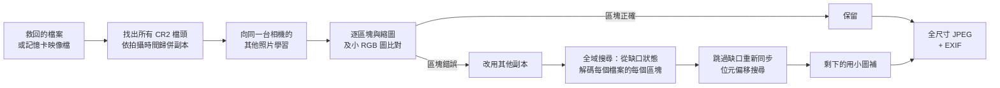

<h1 align="center">cr2-rescue</h1>

<p align="center">
  <b>救回損毀、打不開的 Canon CR2 RAW 照片（記憶卡救援後的修復工具）</b><br>
  照片救回來卻打不開、下半部變灰色、顏色錯亂、畫面錯位或檔案只剩一半？<br>
  cr2-rescue 會把屬於這張照片的資料一塊塊找回來、拼回原位，重建完整大小的照片。
</p>

<p align="center">
  <a href="https://github.com/yin1218/cr2-rescue/actions/workflows/ci.yml"></a>
  <a href="LICENSE"></a>
  
  
  <a href="https://github.com/yin1218/cr2-rescue/stargazers"></a>
</p>

<p align="center">
  <a href="#快速開始">快速開始</a> •
  <a href="#運作原理">運作原理</a> •
  <a href="#常見問題">常見問題</a> •
  <a href="#和其他工具的比較">和其他工具比較</a> •
  <a href="#限制">限制</a><br>
  [<a href="README.md">English</a>] [繁體中文]
</p>

<p align="center"></p>
<p align="center"><sub>合成示範資料（由 <a href="examples/make_demo.py">examples/make_demo.py</a> 產生）。「修復前」是一般看圖軟體顯示的樣子。</sub></p>

## 為什麼需要它

記憶卡誤刪、格式化或壞掉，用 **PhotoRec、Disk Drill、Recuva、EaseUS、R-Studio** 等救援軟體把 `.CR2` 救回來之後，
卻發現很多照片**打不開**、**一半是灰色**、**顏色怪怪的或整塊錯位**，或是**檔案比正常小很多**。

原因是救援軟體假設每個檔案在記憶卡上是連續存放的。但用久的記憶卡，照片常常是**碎片化**的：一張照片的後半段可能放在
另一張照片後面，或某些區塊後來被**覆蓋**掉。看圖軟體和 RAW 軟體就會讀到錯的資料。

每個 Canon CR2 檔除了 RAW 資料，還內含一張**全尺寸 JPEG**（就是相機螢幕上看到的那張；1800 萬畫素機型為 5184×3456），
以及兩張小圖。`cr2-rescue` 把小圖當作「地圖」，一個區塊（cluster）一個區塊檢查哪些資料真的屬於這張照片，再重建全尺寸 JPEG：

- ✅ 碎片都找得到時**完全無損**，與相機寫入的內容逐位元相同。
- 🧩 會整合同一張照片的**所有副本**（救援軟體常把同一張照片存好幾份，每份壞在不同地方）。
- 🔎 會在**所有救回的檔案**（或整張記憶卡的映像檔）中搜尋遺失的碎片。
- 🎨 真的找不回來的部分，用該照片自己的小圖補上，得到完整畫面而不是一條灰帶。
- 🧠 **向你的其他照片借資料**：JPEG 檔頭被覆蓋的照片，向同一台相機的其他照片借（每張都是一模一樣的位元組）；
  小圖目錄遺失的照片，依相機機型推算小圖位置；沒有縮圖的照片，借用前後幾分鐘內拍的照片的色彩風格。
- 📷 保留 **EXIF**（拍攝時間、相機、鏡頭、曝光；有安裝 [ExifTool](https://exiftool.org) 時連 Maker Notes 都保留），
  並把檔案日期設成拍攝時間，相簿軟體可以正確排序。
- 🔒 完全**離線**在你的電腦上執行；原始檔案只讀不寫，不會被更動。

## 快速開始

需要 Python 3.10 以上。

```bash
pip install git+https://github.com/yin1218/cr2-rescue.git
# 選用，可保留完整 metadata：  brew install exiftool  /  apt install libimage-exiftool-perl

cr2-rescue scan    ./recovered                  # 列出找到的照片與損壞程度（唯讀、很快）
cr2-rescue recover ./recovered -o ./rescued     # 全部重建
```

`./recovered` 是救援軟體輸出的資料夾（子資料夾也會搜尋）。可以同時給好幾個資料夾，例如兩套救援軟體的輸出——副本越多，
越有機會湊齊所有碎片。

**效果最好的做法：** 直接給它整張記憶卡的映像檔（或和救回的檔案一起給）。映像檔包含每一個區塊，連救援軟體沒存下來的也在：

```bash
sudo ddrescue /dev/sdX card.img card.map        # Linux；macOS：sudo dd if=/dev/rdiskN of=card.img bs=1m
cr2-rescue recover card.img ./recovered --all-files -o ./rescued
```

`--all-files` 會搜尋所有檔案，不只 `*.cr2`（救援軟體有時會把 CR2 資料存成別的副檔名）。

### 輸出結果

```
rescued/
├── intact/          照片本來就沒壞（無損取出）
├── repaired/        碎片全部找到並拼回——無損
├── partial/         大部分救回，其餘用小圖補上             「IMG_1234 (87%).jpg」
├── preview-only/    全尺寸資料已不存在，用小圖放大          「IMG_1234 (preview only).jpg」
├── unverified/      可以解碼，但無法驗證（沒有參考圖，或小圖其實是別的畫面）
├── report.csv       每張照片一列：結果、還原比例、用了哪些檔案/副本
└── report.json
```

### 真實案例

一張損毀的 SD 卡，用救援軟體救回 498 張 EOS M2 照片，很多檔案碎片化或部分被覆蓋。跑一次，筆電約 47 分鐘：

| 結果 | 張數 |
|---|---:|
| intact（無損） | 373 |
| repaired（無損） | 15 |
| partial | 98（中位數救回 72%，其中 24 張 ≥ 90%） |
| preview-only | 8 |
| unverified | 1 |
| failed | 3（大圖和小圖都被覆蓋） |

## 運作原理



1. **掃描**：每個檔案中的每個 CR2 檔頭都是一份「副本」。相機型號與拍攝時間（到 1/100 秒）相同的副本就是同一張照片。
   記憶卡的區塊大小由檔頭位置自動推算。
2. **參考圖**：每個 CR2 都有一張 160×120 的 JPEG 縮圖，和一張未壓縮的 16-bit 線性 RGB 小圖（例如 660×441，含感光元件遮光邊）。
   程式會找出小圖中的實際畫面範圍（每個機型做一次）：只採用「小圖和自己的縮圖對得上」的照片（損壞的記憶卡上，
   很多照片預覽圖完好、小圖卻已被覆寫），再用完好的預覽圖精確到 1 像素；色彩與色調則以縮圖擬合（會忽略損壞的列），
   再把縮圖的顏色逐區轉移過去。小圖中被覆寫的列（整個 16-bit 範圍的雜訊）不需其他參考就能認出來，改用最近的完好列代替。
3. **向其他照片學習**：同一台相機的所有照片共有的東西，從讀得到的那些照片學起來：
   - 預覽圖的 **JPEG 檔頭**（量化表與霍夫曼表——同樣設定拍的每張照片都是相同的位元組）：檔頭被覆蓋的照片借回來後就能再解碼；
   - **小圖的位置**（緊接在預覽圖之後）：小圖目錄遺失的照片仍然有參考圖；
   - **色彩風格**：沒有可用縮圖的照片，先用時間最接近的照片的風格畫出小圖，再用自己已解出的部分重新擬合
     （只做一次整體擬合，外來資料無法讓自己「看起來對」）。

   如果小圖和解出來的畫面根本不同（那裡被寫入了別張照片的資料），就完全不用它：只保留從檔頭開始能連續解碼的部分，
   放進 `unverified/`。小圖存放在預覽圖之後，所以也可能是小圖壞掉：預覽圖若能一口氣解碼到結尾標記、且處處和縮圖相符，
   即使小圖對不上，仍判定為完好。
4. **逐區塊驗證**：逐一解碼 JPEG 的每個 MCU 方塊，把每塊的平均顏色和參考圖比較。畫面開始對不上的第一個區塊，就是檔案出錯的地方。
5. **修復**：從出錯處開始，先試其他副本同位置的資料；再搜尋*所有*輸入檔案的每個區塊，找出能無縫接續畫面的那一塊
   （從缺口處精確的位元與 DC 狀態解碼，並檢查唯一性與歸屬，絕不挪用已完成照片的資料）。
6. **重新同步**：真的找不到接續時，找出缺口後可解碼資料重新開始的位置（位元偏移搜尋 + 與參考圖的正規化互相關 + DC 偏移校正），
   讓遺失一個區塊只損失一條，而不是整張照片的後半部。在平滑的區域（天空、牆面），上下相鄰幾列看起來幾乎一樣，
   這時用「缺了多少位元組」來決定是哪一列。
7. **最後檢查**：所有來自其他副本、全域搜尋或重新同步的資料段，都會整段再和參考圖比一次。在平滑的區域（牆面、暗背景），
   同場景的連拍照片可能通過逐區塊檢查；但整段看就會露出相關性低或亮度偏移，這種資料段會被丟掉，改用小圖補。
8. **補圖與輸出**：無法救回的區域用放大的小圖補上。無損結果逐位元寫出；有補圖的結果以品質 95 重新編碼並寫入 EXIF。

整套演算法用合成記憶卡（[`synth.py`](src/cr2rescue/synth.py)）做端對端測試，重現各種實際狀況：碎片化、區塊被覆蓋、截斷、
多份各壞一處的副本、大圖全毀，以及 JPEG 檔頭、縮圖、小圖被覆蓋。

## 常見問題

### 救回來的 CR2 打不開、檔案損毀，還有救嗎？
很多時候可以。只要檔頭還在，`cr2-rescue` 通常能從內嵌 JPEG 重建全尺寸照片；缺的部分會從其他副本或其他救回的檔案找。
先跑 `cr2-rescue scan`，它會告訴你找到幾張照片、每張有多少能正確解碼。

### 救回的照片一半是灰色、下半部灰掉、顏色錯亂或畫面錯位
這是**檔案碎片化**的典型症狀：從某個位置開始，檔案裡裝的是別張照片的資料（或什麼都沒有）。這正是 `cr2-rescue` 要修的問題。
把所有救回的檔案（或記憶卡映像檔）都給它，它才能找到缺少的那一段。

### 顯示 JPEG 損毀／沒有縮圖
同一台相機用相同設定拍的每張照片，JPEG 開頭的檔頭都一樣，所以 `cr2-rescue` 會向你的其他照片借；缺少縮圖時，
則借用鄰近照片的色彩（見[運作原理](#運作原理)第 3 步）。如果縮圖*和*小圖都被覆蓋，就沒有任何東西能分辨資料是不是這張照片的；
這種照片會照實標示為失敗，不會亂猜。

### PhotoRec（或 Disk Drill、Recuva、EaseUS…）救回的 CR2 大多是壞的
這類「檔案刻錄（carving）」工具會從檔頭開始，把連續的一段資料存成一個檔案。把輸出交給 `cr2-rescue`，最好加上 `--all-files`
並附上記憶卡映像檔。

### 能救回 RAW 原始資料嗎？
不行。它重建的是每個 CR2 都內含的全尺寸 JPEG（8-bit、已套用相機的相片風格，和拍 RAW+JPEG L 得到的 JPEG 相同）。
碎片化檔案中的 RAW 資料沒有可供驗證的結構，所以不嘗試。

### 支援哪些相機？
會寫出 **CR2** 的 Canon 相機（大約 2004–2018 年的單眼，以及 EOS M 系列無反）。開發與測試使用 EOS M2；其他 CR2 機型的檔案結構相同。
**CR3**（較新的 Canon）、NEF、ARW 等格式目前不支援——歡迎貢獻。

### 我的照片會被上傳嗎？
不會。全部在本機執行，不連網，輸入檔案只讀不寫。

### 要跑多久？
重建每張照片只要幾秒。全域搜尋每一輪會把所有輸入檔案的每個區塊讀一次，幾百張照片大約幾分鐘到一小時。
想先快速看結果可以加 `--no-global-search`。

### 剛遺失照片，第一步該做什麼？
立刻停止使用那張記憶卡。先做一份映像檔（ddrescue / dd），之後都只對映像檔操作，並在處理完之前保留記憶卡。

## 和其他工具的比較

| | 找回已刪除的 CR2 | 修復碎片化檔案 | 整合多份副本 | 補齊缺少區域 | 驗證結果 | 免費開源 |
|---|:-:|:-:|:-:|:-:|:-:|:-:|
| **cr2-rescue** | （需搭配救援軟體或映像檔） | ✅ | ✅ | ✅ | ✅ | ✅ |
| [PhotoRec](https://www.cgsecurity.org/wiki/PhotoRec) | ✅ | ❌（只能連續存放的） | ❌ | ❌ | ❌ | ✅ |
| `exiftool -b -PreviewImage` | ❌ | ❌（原樣取出） | ❌ | ❌ | ❌ | ✅ |
| dcraw / LibRaw / Lightroom | ❌ | ❌ | ❌ | ❌ | ❌ | – |

一般照片修復軟體主要修的是損壞的檔頭與檔案結構；碎片化檔案的結構完好、但裡面的資料是錯的，必須把碎片找回來並依序拼好。
`cr2-rescue` 是救援軟體的好搭檔：先用 PhotoRec（或任何工具）把檔案救回來，再用 `cr2-rescue` 把照片補完整。

## 限制

- 輸出的是內嵌 JPEG，不是 RAW（見常見問題）。
- 用小圖補上的區域會比較模糊（小圖約是全寬的 1/8）。檔名會標示真實資料的比例：`IMG_1234 (87%).jpg`。
- 照片需要有 CR2 檔頭（檔案最前面：拍攝時間與各部分的位置）；其中的 JPEG 檔頭壞了可以向同一台相機的其他照片借。在記憶卡上被覆蓋、且沒有任何副本的區塊，就真的救不回來了。
- 搜尋假設記憶卡是 FAT32/exFAT（檔案以區塊對齊），這也是相機使用的格式。

## Python API

```python
from cr2rescue.recover import Options, recover

rows = recover(['./recovered'], './rescued', Options(all_files=True, jobs=4))
for r in rows:
    print(r['name'], r['category'], r['coverage'])
```

## 開發

```bash
git clone https://github.com/yin1218/cr2-rescue && cd cr2-rescue
pip install -e '.[dev]'
pytest                      # 產生合成的損壞記憶卡並做端對端修復
python examples/make_demo.py
```

請見 [CONTRIBUTING.md](CONTRIBUTING.md)。回報問題時歡迎附上 `report.csv` 與 `scan` 的輸出——請不要附上個人照片。

## 致謝

[PhotoRec/TestDisk](https://www.cgsecurity.org/)（檔案刻錄）、[ExifTool](https://exiftool.org)（metadata）、
[Laurent Clévy 的 CR2 格式說明](https://github.com/lclevy/libcraw2)、
[NumPy](https://numpy.org)、[Numba](https://numba.pydata.org)、[Pillow](https://python-pillow.org)、[SciPy](https://scipy.org)。

## 授權

[MIT](LICENSE)

<sub>關鍵字：CR2 修復、CR2 檔案損毀、CR2 打不開、Canon RAW 照片救援、記憶卡照片救回後無法開啟、照片一半灰色、照片下半部灰色、
照片顏色錯亂、檔案碎片化修復、PhotoRec CR2 損毀、SD 卡照片救援、相片修復、佳能照片修復、RAW 檔修復。</sub>
